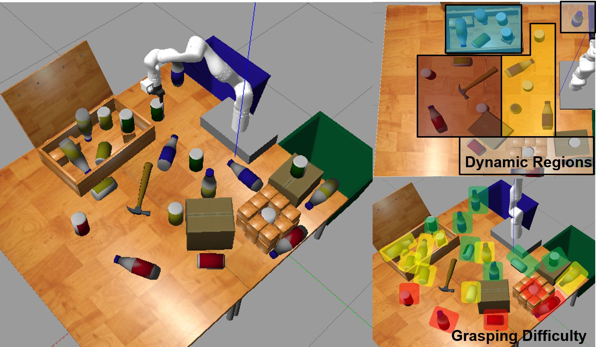

# Resources for RoboCup Virtual Robot Manipulation Challenge
<!-- This is the "Title of the contribution" that was approved during the Community Contribution Review Process --> 

  
<!-- Add this icon to the README if this repo also appears on File Exchange via the "Connect to GitHub" feature --> 

This GitHub repository contains MATLAB and Simulink utilities and templates to get started developing algorithms for the RoboCup Virtual Robot Manipulation Challenge. The templates include how to control the simulated robot in Gazebo using ROS and how to obtain data from the available robot sensors to be used in perception algorithms.

This GitHub repository also contains e-certificates for finalists of the challenge that have demonstrated outstanding robotics development skills by completing and submitting succesful entries.

The 2023 RoboCup Virtual Manipulation Challenge will be open for registration after December 2023. For more information [visit the challenge website](https://arm.robocup.org/) and [sign up to get updates](https://docs.google.com/forms/d/e/1FAIpQLScA6JcHRV1qmh_-VWikgCfj62jg-GcQYgQsk6iYd8wBoeDpEg/viewform).

  

Request [Complimentary MATLAB license for RoboCup Participants here](https://www.mathworks.com/academia/student-competitions/robocup.html)

# Instructions for Installing and Opening Virtual Environments
1. Follow [instructions here (Appendix A) to install VM image or setup Docker container](https://drive.google.com/file/d/1w9tBy3DKmZBKEfOqOFUXcT8hcQig6sNS/view), using the archive from the step above
2. Open a command line terminal and navigate to ~src/arm_gazebo/docker
3. execute the the run script (./run.bash)

  
  NOTE for MAC and Linux users: You might have to change the network bridging options in the Virtual Machine. Refer to this post: https://www.mathworks.com/matlabcentral/answers/392422-cannot-connect-to-ros-master-running-on-virtual-machine

# Product Requirements
MATLAB  
Simulink  
Stateflow  
Robotics System Toolbox  
ROS Toolbox  
Computer Vision Toolbox  
Image Processing Toolbox  
