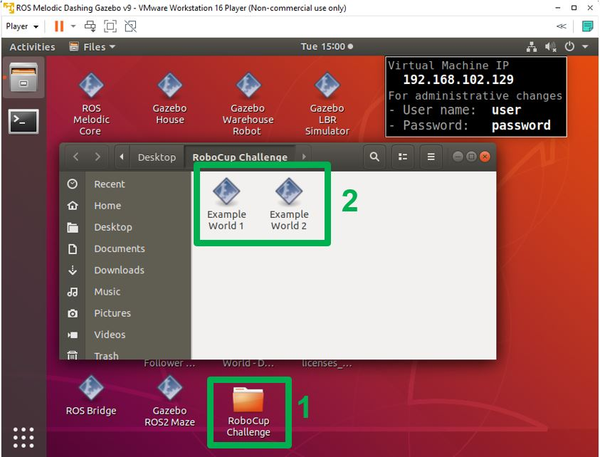

# Templates for RoboCup Virtual Robot Manipulation Challenge
<!-- This is the "Title of the contribution" that was approved during the Community Contribution Review Process --> 

  
<!-- Add this icon to the README if this repo also appears on File Exchange via the "Connect to GitHub" feature --> 

This GitHub repository contains MATLAB and Simulink utilities and templates to get started developing algorithms for the RoboCup Virtual Robot Manipulation Challenge. The templates include how to control the simulated robot in Gazebo using ROS and how to obtain data from the available robot sensors to be used in perception algorithms.

The 2022 RoboCup Virtual Manipulation Challenge will be open for registration after January 10th 2022. For more questions contact roboticsarena@mathworks.com

  

Request [Complimentary MATLAB license for RoboCup Participants here](https://www.mathworks.com/academia/student-competitions/robocup.html)

# Instructions for Installing and Opening Virtual Environments
1. Follow [instructions here](https://www.mathworks.com/support/product/robotics/ros2-vm-installation-instructions-v4.html), using the archive from the step above
2. Launch virtual machine
3. Click on the "RoboCup Challenge" folder in the desktop
4. Click on the desired test environment shortcut

# Product Requirements
MATLAB  
Simulink  
Stateflow  
Robotics System Toolbox  
ROS Toolbox  
Computer Vision Toolbox  
Image Processing Toolbox  
